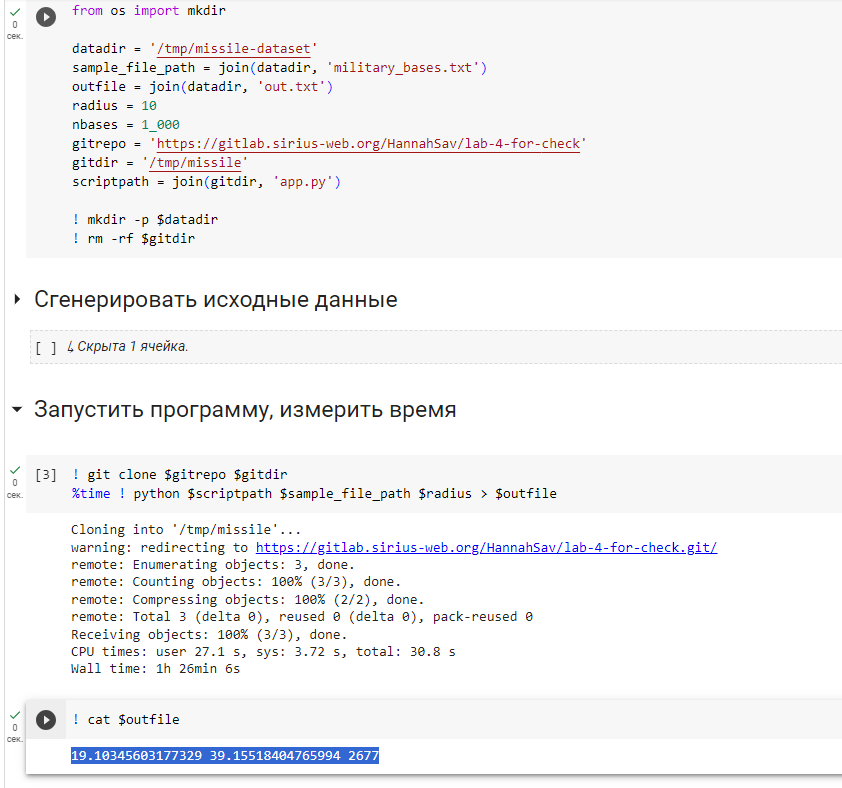
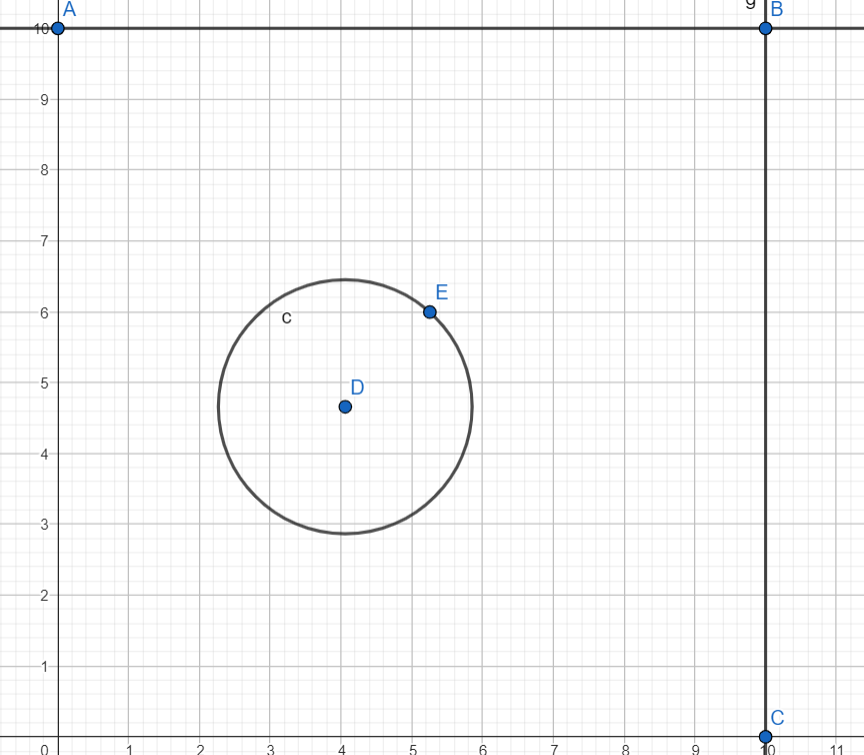
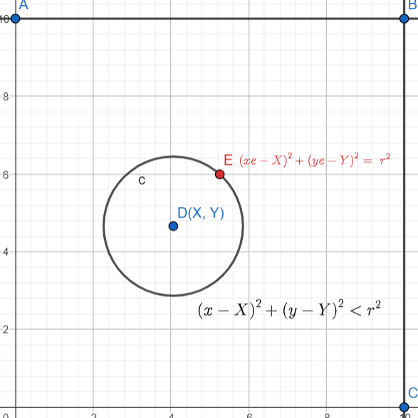
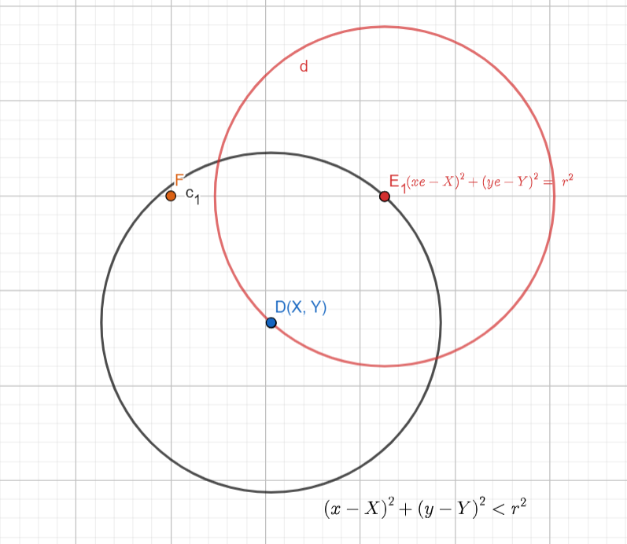
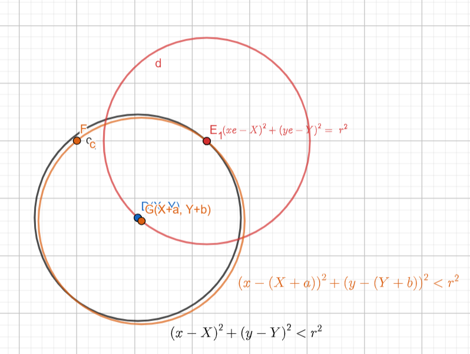
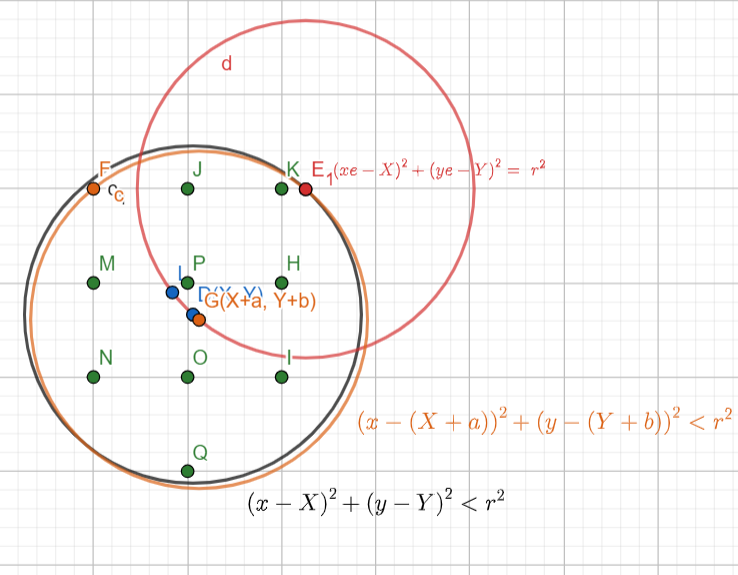
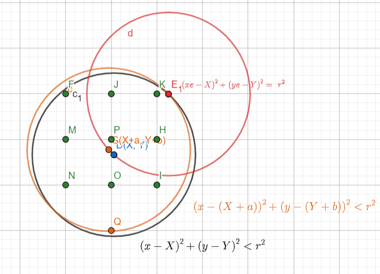

Еще раз 4я без классов и тд
тесты на гитлабе проходит на варианте с целочисленными значениями центров

результат в коллабе для нецелочисленных значений:

  
  

## Доказательство решения

### окружности, проходящие через пары целочисленных точек(баз) 
~~Кажется, это не универсальное решение и может быть ситуация, когда лучшее решение проходит лишь через одну точку~~  
~~_Возможно это дополнится рисунком_~~  
А может и универсальное, видимо так попробую доказать это.

**Почему это работает вообще?**  
Пусть мы строим окружность, проходящую через одну точку

Докажем, что мы можем сместить окружность так, чтобы она опиралась на две точки, и при этом все те точки, которые были в окружности - останутся в окружности   
Все точки в нашей окружности можно описать так:  

Находим точку, ближайшую к контуру окружности(Точка F на картинке-примере. Ближайшая при повороте по или против часовой стрелки)  
~~__Причем видимо расстояние до контура окружности необязательно по линии радиуса__~~
НЕТ! Расстояние от точки до окружности = __РАДИУС - (РАССТОЯНИЕ ОТ ЦЕНТРА ОКРУЖНОСТИ ДО ТОЧКИ)__
  
  
И строим окружность, которая проходит через нее и через нашу начальную точку, на которую опиралась  
  
  
Доказать, что остальные точки останутся внутри окружности:  
  
(По построению эта точка является первой которая соприкоснулась с окружностью при повороте, а значит, все остальные точки, которые были внутри окружности в ней и останутся)  
  
ПРИМЕР:  
Точки F, J, K, M, P, H, N, O, I, Q были внутри окружноси, когда мы начали вращать окружность против часовой стрелки относительно точки E1, то первая соприкоснулась точка F. Все остальные не пересекали контур окружности и так и остались внутри  
(могли конечно добавиться новые. Но поскольку их вес не может быть отрицательным, то нам это не важно)  
  
  
То же самое происходит, если бы мы вращали по часовой стрелке  
  

  
# TODO
  
1. Реализовать через две точки, лежащие на окружности  
   ~~1.0 Доказать, что это правда вообще~~  
   ~~1.1 Классы точек, ракеты, зданий~~  
   ~~1.2 Функция подсчета суммы для конкретной окружности (решение геометрическое через хорду и нормаль к ней)~~  
   +учитывать ошибку подсчетов надо  
   ~~1.3 Перебор пар точек, на которые опирается окружность~~
   ~~1.4 Переделать проходя не по полю, а по точкам, чтобы это работало~~
   ~~1.5 Целочисленные координаты центра~~