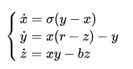

# Лоренц Аттрактор

https://ru.m.wikipedia.org/wiki/%D0%90%D1%82%D1%82%D1%80%D0%B0%D0%BA%D1%82%D0%BE%D1%80_%D0%9B%D0%BE%D1%80%D0%B5%D0%BD%D1%86%D0%B0

 
## Пример для данных:   
step = 0.02   
Interval = (-8, 8)  
Noise = (0.01, 0.01, 0.01)  
sigma = 10   
beta = 2.667   
ro = 28   
start point = (0, 1, 1.05)

  

### Animation:  

  
## Пример для данных:   
step = 0.02   
Interval = (0, 75)  
Noise = (0.01, 0.01, 0.01)  
sigma = 10   
beta = 2.667   
ro = 28   
start point = (0, 1, 1.05)

  

### Animation:  

  

